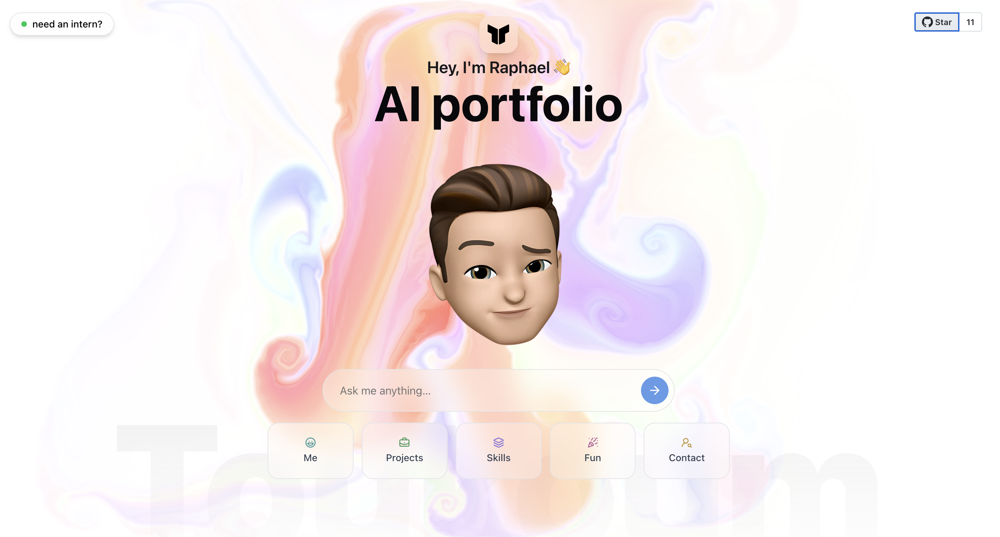

 
# World's first AI portfolio 🤖✨  

**Static portfolios are dead.**  
So I built this interactive AI portfolio.

Instead of making you scroll endlessly, my portfolio adapts to *you*.  
Ask a question — my AI avatar replies instantly.

## 👇 What can you ask?

- 🧠 **Tech recruiter?** Ask about my stack & results  
- 💻 **Dev?** Dive into my code & mindset  
- 🧑‍🤝‍🧑 **Friend or family?** See what I've been working on  

---

This is not a portfolio.  
It's a **conversation tailored to your curiosity**.

## 🚀 Setup Instructions

### 1. Get your Groq API Key (FREE!)

1. Go to [Groq Console](https://console.groq.com/)
2. Sign up for a free account
3. Navigate to API Keys section
4. Create a new API key
5. Copy your API key

### 2. Configure Environment Variables

1. Rename `.env.local` to `.env.local` (if not already)
2. Replace `your_groq_api_key_here` with your actual Groq API key:

```env
GROQ_API_KEY=gsk_your_actual_groq_api_key_here
```

### 3. Install Dependencies & Run

```bash
npm install
npm run dev
```

## 🔧 Why Groq?

- **FREE**: Generous free tier with high rate limits
- **FAST**: Extremely fast inference speeds
- **RELIABLE**: High-quality responses with Llama models
- **COST-EFFECTIVE**: Perfect for personal projects and portfolios

## 🎯 Features

- Interactive AI-powered chat interface
- Dynamic content based on user questions
- Responsive design with smooth animations
- Tool-based responses (projects, skills, contact, etc.)
- Real-time streaming responses

## 📝 Customization

To customize this portfolio for yourself:

1. Update the system prompt in `src/app/api/chat/prompt.ts`
2. Modify the tools in `src/app/api/chat/tools/`
3. Replace images and content in the `public/` folder
4. Update personal information throughout the components

#### 🔖 Tags

`#AIPortfolio` `#InnovationInTech` `#DigitalResume` `#JobSearch` `#TechInnovation` `#WebDevelopment` `#FutureTech` `#Groq` `#LlamaAI`